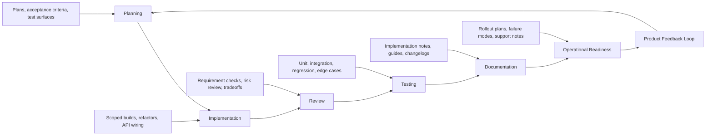

# How I Would Deploy Codex Across an Engineering Team's SDLC

## A practical adoption playbook for AI-assisted software delivery

**Prepared by:** Troy Assoignon  
**Target role:** AI Deployment Engineer, Codex  
**Positioning:** Customer-facing technical builder focused on turning ambiguous workflows into usable AI-assisted systems.

---

## Executive Thesis

Codex should not be deployed as "an AI coding tool engineers can try." It should be deployed as an operating layer across the software development lifecycle.

The highest-leverage adoption pattern is to identify repeatable engineering workflows where Codex can reduce ambiguity, accelerate implementation, improve review quality, expand test coverage, and preserve engineering judgment. That means treating Codex deployment as a workflow design problem, not just a tooling rollout.

The goal is not to replace engineering ownership. The goal is to help engineering teams move faster while improving the quality of plans, code, tests, documentation, and operational readiness.

This playbook outlines how I would help an engineering organization adopt Codex across six SDLC surfaces:

1. Planning
2. Implementation
3. Review
4. Testing
5. Documentation
6. Operational readiness

For each surface, the deployment motion is the same:

- Identify high-friction workflows.
- Define where Codex should assist.
- Preserve human decision points.
- Create reusable prompts, examples, and reference implementations.
- Measure outcomes.
- Capture product and model feedback from real usage.

---

## Why This Matters

Engineering teams are under pressure to ship faster without lowering quality. Most teams already have more specs, tickets, code paths, migrations, bugs, test gaps, and documentation debt than they can process. Codex creates leverage when it is aimed at those bottlenecks with clear context, narrow scope, and disciplined review.

The best deployments will not be one-off demos. They will become embedded workflows:

- A product spec becomes an implementation plan, test map, and acceptance checklist.
- A bug report becomes a trace through the codebase, a likely root cause, and a regression test.
- A refactor becomes a staged migration plan with risk areas and validation steps.
- A pull request becomes a structured review against requirements, security assumptions, and test coverage.
- A release becomes a rollout checklist, support note, and post-deployment review artifact.

Codex is most valuable when it helps teams move from vague intent to executable engineering work.

---

## Deployment Principles

### 1. Start With Real Workflows

Adoption should begin inside the work engineers already do: tickets, PRs, test failures, incidents, migrations, and release planning. Abstract training is useful, but durable adoption comes from helping teams complete real work with Codex.

### 2. Keep Tasks Scoped

Codex performs best when given a clear target, local context, relevant files, expected output, and validation criteria. Teams should learn to frame tasks like strong GitHub issues: objective, context, constraints, examples, acceptance criteria, and test expectations.

### 3. Preserve Human Ownership

Codex can propose plans, write code, find risks, and generate tests. Engineers remain responsible for design judgment, code quality, security posture, and production readiness.

### 4. Make Review a First-Class Workflow

The purpose of Codex is not only to create more code. It should also improve how code is reviewed, tested, explained, and operated.

### 5. Build Reusable Patterns

Every successful customer workflow should become a reusable asset: a prompt template, internal guide, workshop exercise, reference implementation, Cookbook-style example, or product feedback note.

### 6. Measure Practical Outcomes

Measure outputs that engineering leaders care about:

- Time from ticket to first working draft
- PR review cycle time
- Test coverage added around changed code
- Defects caught before merge
- Documentation completeness
- Release readiness quality
- Developer adoption by workflow, not just seat usage

---

## SDLC Workflow Map



---

# 1. Planning

## Customer Problem

Many engineering teams lose time before implementation starts. Specs are incomplete, requirements are ambiguous, acceptance criteria are thin, and test surfaces are not obvious until late in the cycle.

## Codex Workflow

Use Codex to convert ambiguous product or technical input into a build-ready plan.

Codex can help:

- Summarize the intended behavior.
- Identify missing requirements.
- Convert a spec into implementation steps.
- Draft acceptance criteria.
- Map affected files, services, components, or APIs.
- Identify test surfaces and edge cases.
- Propose rollout or migration sequencing.

## Example Prompt

```text
You are helping plan implementation for this feature.

Context:
- Product spec: [paste spec]
- Relevant repo areas: [paths or modules]
- Known constraints: [performance, auth, security, API compatibility]

Please produce:
1. A concise implementation plan
2. Acceptance criteria
3. Files or modules likely to change
4. Unit and integration test surfaces
5. Edge cases and failure modes
6. Open questions that should be resolved before coding

Do not write code yet.
```

## Human Review Point

The engineering lead or feature owner reviews the plan before implementation begins. The goal is to catch wrong assumptions early, not after a PR is already open.

## Measurable Output

- Fewer unclear tickets entering implementation
- Faster first working draft
- Better test planning before code is written
- Reduced rework caused by misunderstood requirements

---

# 2. Implementation

## Customer Problem

Engineers often spend time on boilerplate, unfamiliar code paths, API wiring, repetitive refactors, and small backlog items that are important but not complex enough to justify deep context switching.

## Codex Workflow

Use Codex for scoped implementation tasks where the desired outcome can be validated through tests, local builds, or review.

High-value implementation workflows:

- Build a small feature from a reviewed plan.
- Wire an API route to an existing service pattern.
- Generate a UI component following existing design conventions.
- Refactor a repeated pattern across files.
- Isolate a bug by tracing code paths.
- Create migration scripts or config changes.
- Stub a first working version for human refinement.

## Example Prompt

```text
Implement the feature described below using the existing patterns in this repo.

Goal:
[feature goal]

Relevant files:
[file paths]

Constraints:
- Follow the existing service/component pattern in [example file]
- Keep the change scoped
- Add or update tests
- Do not introduce new dependencies unless necessary
- Explain any tradeoffs before finalizing

Acceptance criteria:
[criteria]
```

## Human Review Point

The engineer reviews the diff, runs tests, checks architecture fit, and verifies that Codex followed local conventions. Codex should accelerate the draft, not bypass engineering judgment.

## Measurable Output

- Reduced time to first PR
- More low-priority fixes completed
- Faster refactors and migrations
- Better use of fragmented engineering time

---

# 3. Review

## Customer Problem

PR review is often constrained by reviewer bandwidth. Reviewers may focus on code style and miss requirement drift, missing tests, security implications, edge cases, or operational concerns.

## Codex Workflow

Use Codex as a review assistant that compares the PR against the original intent and flags gaps for the human reviewer.

Review surfaces:

- Requirement coverage
- Missing acceptance criteria
- Missing or weak tests
- Security and data handling risks
- Performance regressions
- API compatibility issues
- Error handling and observability gaps
- Migration and rollback risks

## Example Prompt

```text
Review this PR as a senior engineer.

Inputs:
- Original ticket/spec: [paste]
- PR diff: [attach or reference]
- Test output: [paste if available]

Focus on:
1. Behavioral correctness against the spec
2. Missing test cases
3. Security or data handling risks
4. Performance or reliability concerns
5. Operational readiness gaps
6. Tradeoffs the reviewer should understand

Return findings ordered by severity. Do not nitpick style unless it affects maintainability.
```

## Human Review Point

The reviewer treats Codex output as a second-pass checklist. Codex should help focus human attention, not create automatic approval.

## Measurable Output

- More complete PR reviews
- Fewer missed edge cases
- Faster reviewer ramp-up in unfamiliar code
- Better review consistency across teams

---

# 4. Testing

## Customer Problem

Test coverage often lags implementation. Engineers may cover the happy path but miss boundary conditions, invalid states, integration behavior, and regression cases tied to prior incidents.

## Codex Workflow

Use Codex to generate test maps and draft runnable tests around changed behavior.

Testing workflows:

- Generate unit tests for changed functions.
- Add integration tests for API behavior.
- Create regression tests for reproduced bugs.
- Identify boundary conditions and invalid states.
- Expand thin test files around critical modules.
- Explain what is not covered and why.

## Example Prompt

```text
Generate a test plan and then implement the highest-value tests.

Context:
- Changed files: [paths]
- Intended behavior: [summary]
- Existing test patterns: [paths]

Please:
1. Identify the most important test cases
2. Prioritize edge cases and failure paths
3. Add tests using existing repo conventions
4. Run or describe the relevant test command
5. Call out any coverage gaps that remain
```

## Human Review Point

The engineer verifies that tests are meaningful, deterministic, and aligned with the intended behavior. Generated tests should not simply assert the implementation's current behavior if that behavior may be wrong.

## Measurable Output

- More tests around changed code
- Better regression protection
- Faster test authoring
- Better visibility into untested failure modes

---

# 5. Documentation

## Customer Problem

Documentation is frequently created late or skipped entirely. This makes onboarding, review, incident response, migrations, and future maintenance harder.

## Codex Workflow

Use Codex to produce documentation directly from implementation context.

Documentation workflows:

- Implementation notes for a feature or refactor
- Migration guides
- API usage examples
- Changelog entries
- Onboarding docs for unfamiliar modules
- Architecture summaries
- Known limitations and follow-up tasks

## Example Prompt

```text
Create internal documentation for this change.

Inputs:
- PR summary: [paste]
- Changed files: [paths]
- Important decisions: [notes]
- Known limitations: [notes]

Please produce:
1. A concise implementation note
2. How to test or validate the change
3. Operational considerations
4. Migration notes if applicable
5. Follow-up work

Write for engineers who will maintain this system later.
```

## Human Review Point

The owner verifies that the documentation captures the real design decisions and does not invent unsupported claims.

## Measurable Output

- More complete implementation notes
- Faster onboarding into unfamiliar systems
- Better migration handoffs
- Reduced knowledge loss after launch

---

# 6. Operational Readiness

## Customer Problem

Many software failures are not caused by code alone. They come from incomplete rollout planning, unclear failure modes, weak observability, missing support notes, and poor ownership handoff.

## Codex Workflow

Use Codex to help teams prepare code for production.

Operational readiness workflows:

- Rollout checklist
- Failure-mode analysis
- Observability and telemetry review
- Backward compatibility review
- Support and escalation notes
- Post-deployment review template
- Rollback plan

## Example Prompt

```text
Prepare an operational readiness review for this release.

Inputs:
- Feature summary: [paste]
- Architecture notes: [paste]
- PRs or changed modules: [links/paths]
- Known risks: [paste]

Please produce:
1. Rollout checklist
2. Failure modes
3. Required monitoring or alerts
4. Customer/support impact
5. Rollback plan
6. Post-deployment review questions
```

## Human Review Point

Engineering, product, support, and customer-facing teams validate readiness together. Codex helps create the checklist, but accountable owners decide whether the release is ready.

## Measurable Output

- Fewer missed rollout steps
- Clearer support readiness
- Better incident preparation
- Stronger post-launch learning loop

---

# Rollout Plan

## Phase 1: Discovery and Workflow Selection

Duration: 1-2 weeks

Activities:

- Interview engineering leaders, senior ICs, platform owners, and support stakeholders.
- Review current SDLC pain points.
- Identify 3-5 high-friction workflows where Codex can provide immediate leverage.
- Select a pilot team with motivated engineering users and a measurable workflow.

Outputs:

- Workflow inventory
- Pilot success criteria
- Risk and guardrail list
- Initial prompt and enablement plan

## Phase 2: Pilot

Duration: 2-4 weeks

Activities:

- Run hands-on Codex workshops using the team's real repo and real tickets.
- Build workflow-specific prompt templates.
- Create reference examples for planning, implementation, review, testing, docs, and readiness.
- Track before/after outcomes on selected workflows.
- Collect qualitative feedback from engineers and reviewers.

Outputs:

- Pilot workflow examples
- Reference prompts
- Before/after metrics
- Engineering feedback
- Product insights and friction log

## Phase 3: Scale

Duration: 4-8 weeks

Activities:

- Convert pilot learnings into internal guides.
- Train engineering leads and champions.
- Add repo-specific context files or setup guidance where useful.
- Expand from one team to adjacent teams.
- Create repeatable enablement sessions and office hours.

Outputs:

- Team adoption playbook
- Internal Codex guide
- Workshop materials
- Reusable demos
- Product feedback summary

## Phase 4: Operationalize

Duration: ongoing

Activities:

- Review adoption metrics.
- Maintain prompt libraries and examples.
- Identify new SDLC surfaces for Codex adoption.
- Capture model/product feedback from real customer usage.
- Publish reusable technical patterns where appropriate.

Outputs:

- Adoption dashboard
- Ongoing best-practice updates
- Customer workflow case studies
- Cookbook-style examples
- Product and model feedback reports

---

# Adoption Metrics

## Leading Indicators

- Number of engineers using Codex in real workflows
- Number of Codex-assisted PRs opened
- Number of prompt templates reused
- Number of generated tests accepted after review
- Number of workflow examples created
- Workshop attendance and follow-up usage

## Quality Indicators

- PR review findings caught before merge
- Test coverage added around changed code
- Defects avoided or caught earlier
- Reduction in ambiguous tickets entering implementation
- Documentation completeness for shipped changes
- Rollout checklist completion rate

## Business and Team Indicators

- Time from ticket intake to first working draft
- PR cycle time
- Backlog items completed
- Engineer-reported context switching reduction
- Faster onboarding into unfamiliar systems
- Customer confidence in AI-assisted engineering workflows

---

# Guardrails and Risks

## Risk: Overtrusting Generated Code

Mitigation:

- Require human review for all Codex-generated changes.
- Encourage engineers to ask Codex to explain tradeoffs and failure modes.
- Pair implementation prompts with test and review prompts.

## Risk: Poor Context Produces Poor Output

Mitigation:

- Teach teams to include file paths, examples, constraints, and acceptance criteria.
- Maintain repo-specific context where useful.
- Start large changes in planning mode before implementation.

## Risk: Security and Data Handling Gaps

Mitigation:

- Include security review prompts in PR workflows.
- Define boundaries for sensitive code, credentials, logs, and customer data.
- Add explicit security expectations to team prompt templates.

## Risk: More Code Without More Quality

Mitigation:

- Measure accepted tests, review quality, and defect reduction, not just code volume.
- Use Codex for review, testing, and operational readiness, not only implementation.

## Risk: Adoption Stalls After Initial Excitement

Mitigation:

- Anchor adoption in real team pain points.
- Build internal champions.
- Keep examples specific to the team's repo and workflow.
- Track outcomes engineering leaders already care about.

---

# Product Feedback Loop

A strong Codex deployment motion should generate high-fidelity product insight.

During customer deployments, I would capture:

- Where users get stuck when prompting Codex
- Which workflows produce reliable value
- Which workflows require too much correction
- What context Codex lacks by default
- Which setup issues increase error rates
- Which review and safety patterns customers need
- What enterprise teams ask for repeatedly

Those insights should be converted into:

- Product proposals
- Model feedback
- Internal deployment notes
- Cookbook-style examples
- Customer enablement materials
- Reference implementations

The customer-facing deployment role is valuable because it sits close to the real adoption surface. The best product insights will come from watching engineers use Codex on real work, under real constraints, in real organizations.

---

# Example Workshop Agenda

## Workshop: Deploying Codex Across the SDLC

Audience:

- Engineering leaders
- Senior ICs
- Platform engineers
- Developer productivity teams
- Solutions and enablement stakeholders

Duration: 90 minutes

## Agenda

1. Current SDLC friction points
2. Codex deployment principles
3. Live workflow: ambiguous ticket to implementation plan
4. Live workflow: implementation plan to scoped code change
5. Live workflow: PR review and missing test detection
6. Operational readiness checklist generation
7. Team-specific adoption planning

## Workshop Outputs

- One real workflow selected for pilot
- Initial prompt template
- Success metric
- Owner and next step
- Risks and guardrails

---

# Example Customer Scenario

## Scenario

A 75-person engineering organization has adopted AI coding tools inconsistently. Some engineers use them heavily, some avoid them, and leadership is unsure whether adoption is improving delivery quality or simply producing more code.

## Deployment Approach

Start with one platform team responsible for internal APIs and developer tooling.

Pilot workflows:

1. Turn tickets into implementation plans and test maps.
2. Use Codex for scoped API route changes.
3. Use Codex to review PRs against acceptance criteria.
4. Use Codex to generate regression tests for bug fixes.
5. Use Codex to produce release readiness checklists.

## Success Criteria

After 30 days:

- 10-15 Codex-assisted PRs completed
- 5 reusable prompt templates created
- Test coverage added to at least 70% of Codex-assisted implementation PRs
- Review checklist used on all pilot PRs
- Engineering feedback captured and converted into deployment recommendations

## Expected Outcome

The organization moves from informal AI tool usage to a repeatable Codex deployment pattern with clear workflows, measurable outputs, and guardrails that preserve engineering ownership.

---

# Why I Am a Fit for This Work

My background sits at the intersection this role requires: customer-facing technical strategy, AI-assisted implementation, workflow design, and executive communication.

I have built AI-assisted systems that turn ambiguous conversations and unstructured data into structured, decision-ready outputs. I have used tools like Codex, Cursor, ClaudeCode, React, Next.js, Supabase, RAG patterns, and voice AI to move from concept to working demo quickly. I have also worked directly with founders, operators, and technical buyers where the core job is not just building, but translating complexity into adoption.

For Codex deployment, that combination matters. Engineering teams need more than a feature walkthrough. They need someone who can understand their workflow, build credible demos, identify adoption surfaces, explain tradeoffs, capture product feedback, and help them operationalize AI-assisted development safely.

This is the work I want to do: help engineering teams turn Codex from an impressive tool into a practical part of how they plan, build, review, test, document, and ship software.

---

# Supporting References

- [OpenAI role posting: AI Deployment Engineer, Codex](https://jobs.ashbyhq.com/openai/179b998f-ae76-4de7-a4d0-c2c30d0b0bc8/). The role emphasizes serving as a technical subject matter expert for Codex, designing AI-enhanced development workflows, building demos and reference implementations, leading workshops, contributing guides and best practices, and translating customer deployments into product feedback.
- [OpenAI, "How OpenAI uses Codex"](https://cdn.openai.com/pdf/6a2631dc-783e-479b-b1a4-af0cfbd38630/how-openai-uses-codex.pdf). The guide highlights Codex usage across code understanding, refactoring, performance optimization, improving test coverage, development velocity, staying in flow, and exploration.
